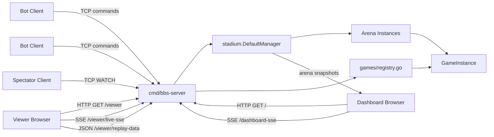
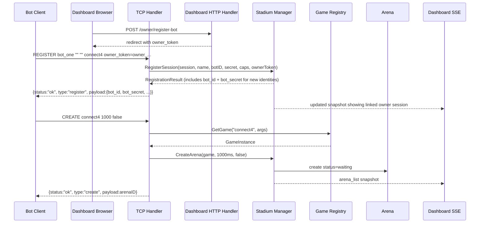
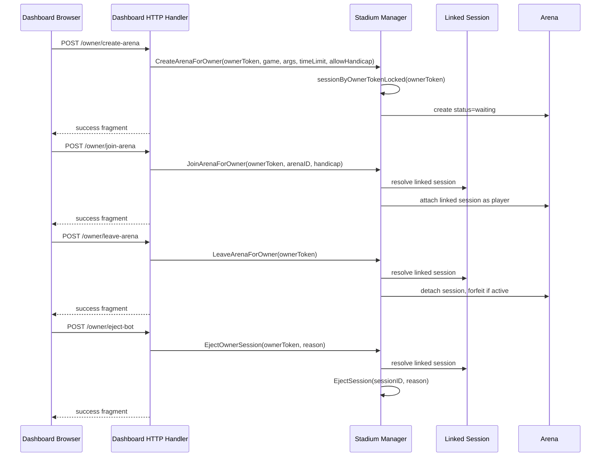
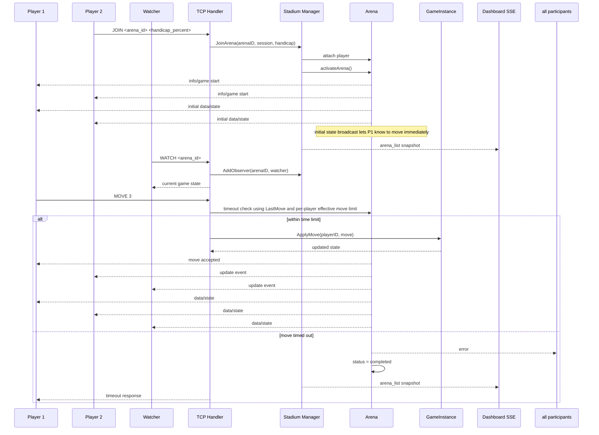
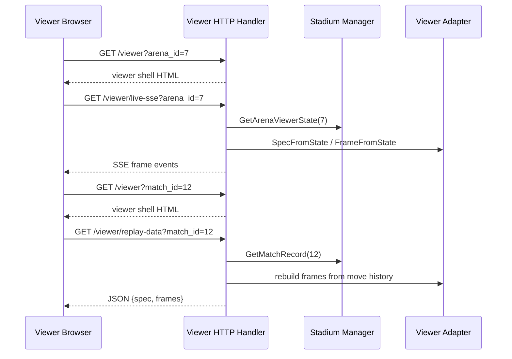
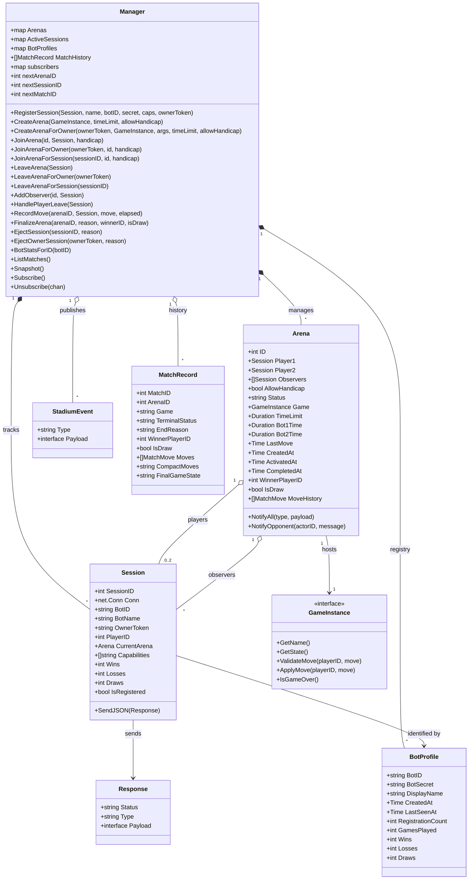

# Build-a-Bot Stadium Architecture

This document describes the architecture of the current runtime, not the earlier split-dashboard or violation-limit experiments.

Today the system runs as a single Go process with two interfaces:

* A TCP bot protocol on port `8080` by default
* An embedded HTTP dashboard on port `3000` by default

These can be overridden at launch with `--stadium <port>` and `--dash <port>`.

The dashboard now serves three related browser surfaces from that same HTTP server:

* the live control deck at `/`
* the live arena viewer at `/viewer?arena_id=<id>`
* the replay viewer at `/viewer?match_id=<id>`

All live state is stored in memory under `stadium.DefaultManager`.

## System Overview

## Design Summary

The executable in `cmd/bbs-server` owns both the bot server and the dashboard server. That matters because the dashboard reads arena state directly from the same in-memory manager instance that the TCP command handlers modify.

There is no persistence layer, job queue, or external message bus. If the process restarts, sessions and arenas are lost.

The current live game registry exposes `connect4` and `gridworld`. Other game packages may exist in the repository, but only registered games can be created at runtime.

## Major Components

### 1. TCP Command Surface

`cmd/bbs-server/main.go` accepts raw TCP connections on the configured stadium port (`8080` default) and handles the bot command loop.

Responsibilities:

* create a `stadium.Session` per connection
* enforce registration before most commands
* translate text commands into manager operations
* serialize responses as newline-delimited JSON
* parse optional dashboard owner tokens during registration
* clean up session and arena references on disconnect

This layer is intentionally thin. It owns transport and command parsing, but not arena lifecycle policy.

### 2. Stadium Manager

`stadium.Manager` is the central in-memory coordinator.

Responsibilities:

* assign session IDs, arena IDs, and match IDs
* track active sessions
* create and mutate arenas
* attach players and observers
* issue and authenticate persistent bot identities (`bot_id` + `bot_secret`)
* issue and resolve browser-minted owner tokens against live sessions
* record per-move history and finalize match records on game over, player leave, timeout, or admin eject
* update win/loss/draw stats on both in-flight sessions and durable `BotProfile` records
* publish full manager snapshots to dashboard subscribers
* run a watchdog for stale arena cleanup

The manager protects its mutable maps with a single `sync.Mutex`. That keeps the model simple, at the cost of coarse-grained locking.

Arenas can now activate with either one or two players based on the game's
`RequiredPlayers()` value (default remains two-player for existing games).

### 3. Arena Model

An `Arena` represents one match or lobby.

Important fields:

* `Player1`, `Player2`
* `Observers`
* `Status`
* `RequiredPlayers`
* `Game`
* `TimeLimit`
* `Bot1Time`, `Bot2Time`
* `LastMove`
* `CreatedAt`, `ActivatedAt`, `CompletedAt`
* `MoveHistory` — ordered slice of `MatchMove` records
* `WinnerPlayerID`, `IsDraw`

In practice the current statuses used by the code are:

* `waiting`
* `active`
* `completed`
* `aborted`

### 4. Game Plug-in Boundary

Games implement `games.GameInstance`:

* `GetName()`
* `GetState()`
* `ValidateMove()`
* `ApplyMove()`
* `IsGameOver()`

The server resolves a requested game through `games.GetGame()`, which uses `games/registry.go` as the registration table.

This is the main extension point for adding new games.

### 5. Bot Registry and Match History

The `Manager` maintains two in-memory collections that survive across arena lifetimes:

* `BotProfiles map[string]*BotProfile` — keyed by `bot_id`. Each profile stores the secret as currently issued, display name, registration count, cumulative game stats, and timestamps. A bot reconnecting with the same `bot_id` + `bot_secret` gets its historical stats back.
* `MatchHistory []MatchRecord` — appended on every arena finalization. Each `MatchRecord` captures participants, outcome, move sequence, elapsed times, and final game state.

The manager also derives owner-linked session views at runtime by scanning active sessions for a matching `OwnerToken`. Owner tokens are not persisted separately.

These structures provide the persistence boundary for a future database layer.

### 6. Embedded Dashboard

`cmd/bbs-server/dashboard.go` starts an HTTP server on the configured dashboard port (`3000` default) in the same process as the TCP server.

Responsibilities:

* serve the dashboard HTML at `/`
* open an SSE stream at `/dashboard-sse`
* mint owner tokens and expose owner-scoped bot controls from the dashboard UI
* serve live/replay viewer routes under `/viewer`
* serve owner POST endpoints at `/owner/register-bot`, `/owner/create-arena`, `/owner/join-arena`, `/owner/leave-arena`, and `/owner/eject-bot`
* serve admin POST endpoints at `/admin/eject-bot`, `/admin/create-arena`, `/admin/leave-arena`, and `/admin/join-arena` (all gated by `BBS_DASHBOARD_ADMIN_KEY`)
* subscribe to `stadium.DefaultManager`
* render each manager snapshot through the HTML templates

The dashboard does not poll and does not maintain its own copy of state.

## Runtime Flows

### Bot Registration And Arena Creation

### Dashboard-Owned Bot Control

### Join, Play, And Spectate

### Live And Replay Viewer Flow

### Dashboard Subscription Flow

## State Ownership

The architecture is intentionally centralized.

* `Session` owns per-connection identity (including the linked `BotID`), live W/L/D counters, and the socket write lock.
* `Session` also owns the optional `OwnerToken` that links a live bot session to one browser view.
* `Manager` owns session registration, arena maps, bot profiles, match history, arena summaries, and subscriber lists.
* `Arena` owns match participation, observer membership, move history, and a concrete `GameInstance`.
* `BotProfile` owns durable identity and cumulative stats across sessions.
* `GameInstance` owns game-specific validation and board state.

Because the manager owns the authoritative arena maps, the dashboard is implemented as a subscriber to manager snapshots rather than as an independent reader or a separate process.

## Concurrency Model

There are three main sources of concurrency:

* one goroutine per TCP client connection
* one goroutine for the HTTP dashboard server, with one handler goroutine per SSE client
* one watchdog goroutine for periodic arena cleanup

Synchronization strategy:

* `Manager.mu` protects arena maps, session maps, ID counters, and subscriber registration
* `Session.mu` protects concurrent writes to a single network connection
* dashboard subscriptions use buffered channels (`chan StadiumEvent, 10`) so the manager does not block on a slow browser

The tradeoff is that subscriber delivery is best-effort. If a subscriber channel is full, the event is dropped instead of blocking the server.

## Watchdog And Cleanup

The watchdog runs every 10 seconds and expires arenas according to status:

| Status | Expires after |
| --- | --- |
| `waiting` | 1 hour |
| `active` | 3× the configured move time limit |
| `completed` | 1 minute |
| `aborted` | 5 minutes |

On cleanup the manager calls `terminateArena`, which notifies any remaining participants, deletes the arena from the map, and publishes a new snapshot to dashboard subscribers. Because `finalizeArenaLocked` nulls out all session references in the arena before returning, a watchdog sweep that fires after finalization finds no participants to notify.

## Current Boundaries And Gaps

The current design is workable, but it has clear boundaries:

* all state is in memory only — process restart drops every session, arena, bot profile, and match record
* one manager mutex serializes all arena and session mutations (coarse-grained; acceptable at current scale)
* dashboard SSE events carry rendered state derived from a full manager snapshot, not fine-grained diffs
* the transport layer still mixes plain text writes (`WATCH`, `QUIT`, `HELP`) and JSON writes in some command paths
* the bot identity system uses a shared secret over plain TCP and stores that secret in memory as-is — susceptible to eavesdropping; a future HMAC nonce challenge would harden this without requiring full PKI
* owner tokens are browser-visible bearer tokens passed in the dashboard URL/query and during `REGISTER`; they are convenient for local control but not yet hardened for an internet-facing deployment
* only one bot session per `bot_id` is permitted at a time; a bot that crashes may be blocked until the old session times out

These are reasonable areas for future cleanup, but they do not change the core architecture described above.

## Structural Model

