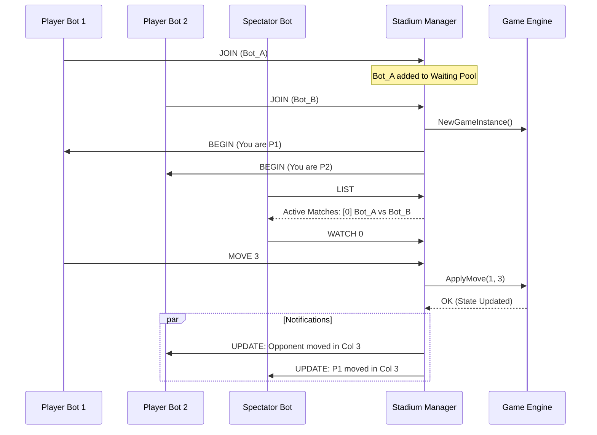

```mermaid
classDiagram
    class Session {
        +string BotName
        +net.Conn Conn
        +int PlayerID
        +Match CurrentMatch
    }

    class Match {
        +Session Player1
        +Session Player2
        +List~Session~ Observers
        +GameInstance Game
        +NotifyAll(msg)
    }

    class Manager {
        +List~Session~ WaitingPool
        +List~Match~ ActiveMatches
        +AddToWaitingRoom(Session)
        +ListGames() string
    }

    Manager "1" *-- "*" Match : orchestrates
    Match "1" o-- "2" Session : players
    Match "1" o-- "*" Session : observers
    Match "1" --> "1" GameInstance : hosts