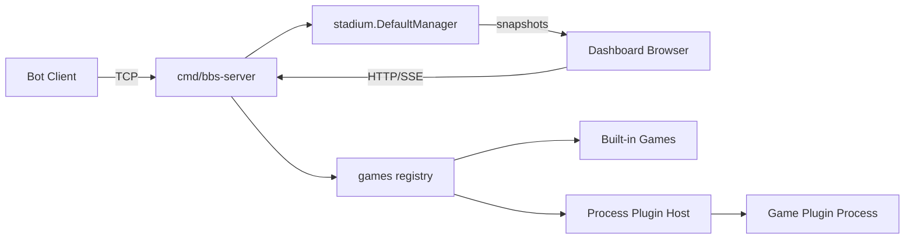

# Build-a-Bot Stadium Architecture

This document describes the current architecture of Build-a-Bot Stadium as an extensible arena platform.

The runtime now supports both built-in games and optional process-based game plugins.

## Runtime Surfaces

A single `cmd/bbs-server` process exposes:

- TCP bot server (`--stadium`, default `:8080`)
- HTTP dashboard and viewers (`--dash`, default `:3000`)

Dashboard surfaces:

- `/` control deck
- `/viewer?arena_id=<id>` live arena viewer
- `/viewer?match_id=<id>` replay viewer

## System Overview

## Core Components

### TCP Command Surface (`cmd/bbs-server/main.go`)

Responsibilities:

- per-connection session lifecycle
- command parsing and authorization
- registration, create/join/watch/move flows
- JSON response emission
- disconnect cleanup

### Stadium Manager (`stadium/`)

The manager is the in-memory source of truth.

Responsibilities:

- active sessions and arenas
- bot profiles and match history
- owner-token linkage to live sessions
- arena activation/finalization
- dashboard snapshot publish/subscribe
- watchdog-based cleanup

Concurrency model:

- coarse manager mutex for state maps/counters
- per-session write lock for socket writes
- buffered subscriber channels for SSE fans

### Game Boundary (`games/engine.go`)

Server logic depends on `games.GameInstance` plus optional policy interfaces:

- `RequiredPlayers()` for one-player or two-player activation
- `EnforceMoveClock()`
- `SupportsHandicap()`
- `AdvanceEpisode()` for episodic environments
- `Close()` (optional cleanup hook for external resources)

### Dynamic Registry (`games/registry.go` + `games/plugin_host.go`)

`GetGame` and `AvailableGameCatalog` now resolve from a merged catalog:

- `builtinRegistry` (compiled games)
- dynamically discovered plugin manifests

Plugin discovery controls:

- `BBS_ENABLE_GAME_PLUGINS=true`
- `BBS_GAME_PLUGIN_DIR=/path/to/plugins` (default `plugins/games`)

Plugin registry refreshes periodically (currently every 2 seconds), so newly added manifests can appear without server restart in most flows.

## Process Plugin Model

Plugins are separate executables, not `.so` in-process Go plugins.

Benefits:

- crash isolation
- cleaner compatibility story across Go versions
- easier future sandboxing/resource controls
- clearer home-developer distribution model

### Manifest

Each plugin is declared by JSON manifest (`*.json`) in plugin dir.

Key fields:

- `protocol_version`
- `name`
- `display_name`
- `executable`
- `supports_move_clock`
- `supports_handicap`
- `args[]` for dashboard/runtime schema

### RPC Contract (`games/pluginapi`)

Transport:

- JSON lines over plugin process stdin/stdout

Methods:

- `init`
- `get_name`
- `get_state`
- `validate_move`
- `apply_move`
- `is_game_over`
- `advance_episode` (optional)
- `shutdown`

Server-side wrapper:

- `games/plugin_process_game.go` implements `GameInstance` and optional policies by forwarding to RPC.
- Plugin process lifecycle is cleaned up via `games.CloseGame(...)` on arena teardown.

### Plugin Author Workflow (v1)

1. Implement a plugin command that calls `pluginapi.Serve(factory)`.
2. Build a standalone executable for that command.
3. Write a JSON manifest with runtime metadata and arg schema.
4. Place binary + manifest in plugin directory.
5. Enable plugin loading via env vars.
6. Validate discovery in dashboard create-arena dropdown.

The manifest `args` schema is intentionally shared with the dashboard's dynamic arena form renderer so plugin authors can define self-describing configuration inputs without dashboard code changes.

## Dashboard Integration

Dashboard create-arena forms are generated from `AvailableGameCatalog()`.

Effects:

- dropdown is always in sync with runtime game catalog
- per-game arg fields are schema-driven
- move-clock/handicap controls auto-adjust by game capability

This means built-ins and valid plugins are presented uniformly in owner and admin create flows.

## Arena Lifecycle

1. Game selected (dashboard or TCP `CREATE` command)
2. `games.GetGame(type, args)` builds game instance
3. Manager creates arena with policy flags and required player count
4. Players/spectators attach
5. Moves flow through `ValidateMove`/`ApplyMove`
6. On terminal outcome, match record is archived
7. Arena cleanup calls `games.CloseGame` for optional resource shutdown

## Current Boundaries

- all manager state remains in-memory
- plugin trust model is currently local/trusted filesystem
- plugin health/version attestation is not yet enforced
- transport security is still plain TCP for bot channel

These are known next-hardening areas, not architectural blockers.
