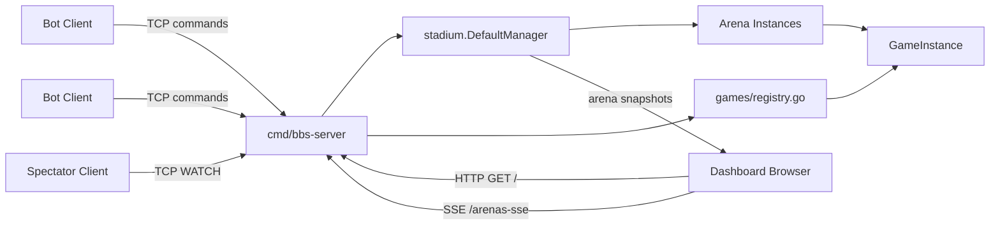
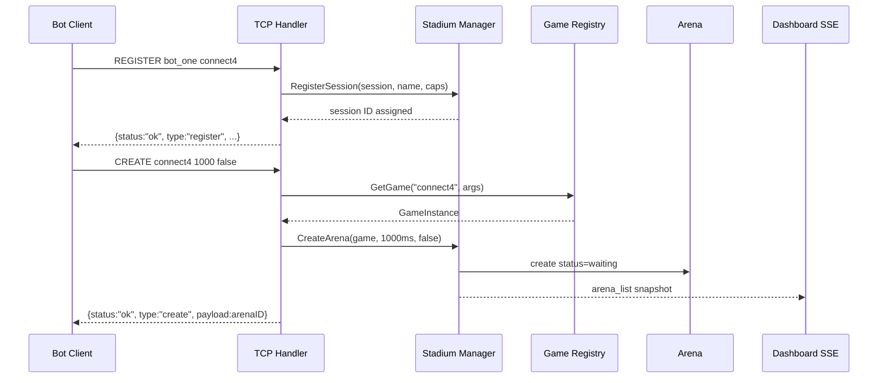
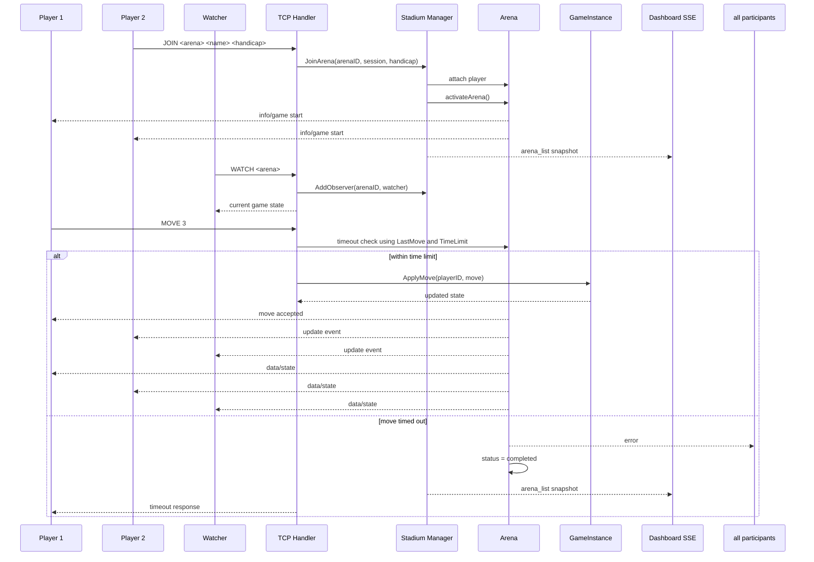
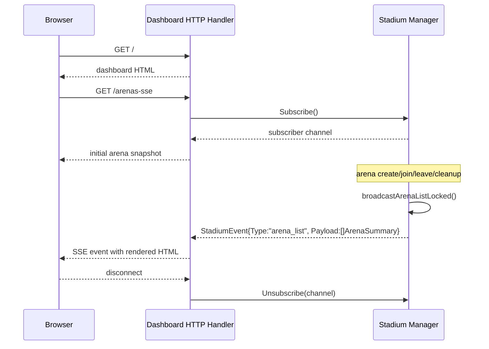
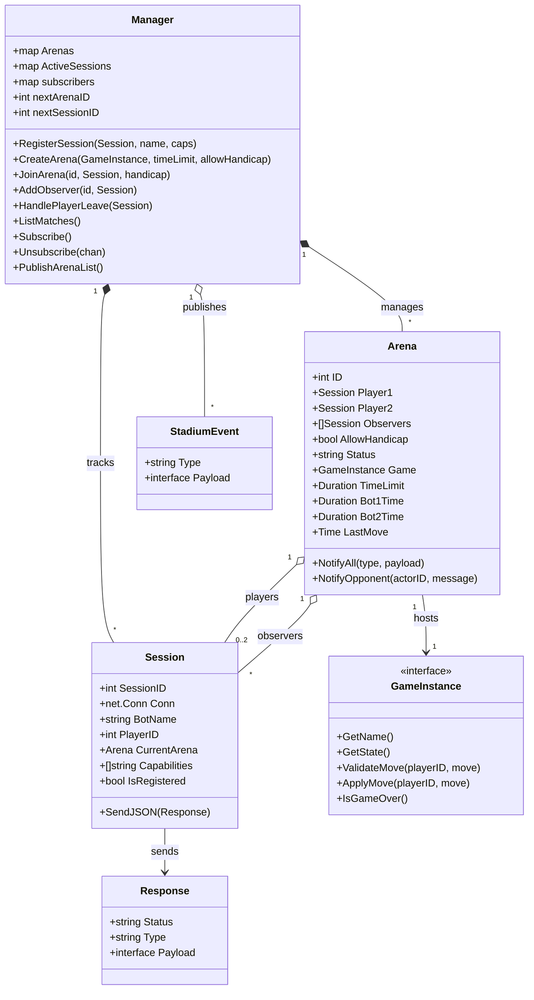

# Build-a-Bot Stadium Architecture

This document describes the architecture of the current runtime, not the earlier split-dashboard or violation-limit experiments.

Today the system runs as a single Go process with two interfaces:

* A TCP bot protocol on port `8080`
* An embedded HTTP dashboard on port `3000`

All live state is stored in memory under `stadium.DefaultManager`.

## System Overview

## Design Summary

The executable in `cmd/bbs-server` owns both the bot server and the dashboard server. That matters because the dashboard reads arena state directly from the same in-memory manager instance that the TCP command handlers modify.

There is no persistence layer, job queue, or external message bus. If the process restarts, sessions and arenas are lost.

The current live game registry exposes `connect4`. Other game packages may exist in the repository, but only registered games can be created at runtime.

## Major Components

### 1. TCP Command Surface

`cmd/bbs-server/main.go` accepts raw TCP connections on port `8080` and handles the bot command loop.

Responsibilities:

* create a `stadium.Session` per connection
* enforce registration before most commands
* translate text commands into manager operations
* serialize responses as newline-delimited JSON
* clean up session and arena references on disconnect

This layer is intentionally thin. It owns transport and command parsing, but not arena lifecycle policy.

### 2. Stadium Manager

`stadium.Manager` is the central in-memory coordinator.

Responsibilities:

* assign session IDs and arena IDs
* track active sessions
* create and mutate arenas
* attach players and observers
* summarize arena state for the dashboard
* publish arena-list snapshots to dashboard subscribers
* run a watchdog for stale arena cleanup

The manager protects its mutable maps with a single `sync.Mutex`. That keeps the model simple, at the cost of coarse-grained locking.

### 3. Arena Model

An `Arena` represents one match or lobby.

Important fields:

* `Player1`, `Player2`
* `Observers`
* `Status`
* `Game`
* `TimeLimit`
* `Bot1Time`, `Bot2Time`
* `LastMove`

In practice the current statuses used by the code are:

* `waiting`
* `active`
* `completed`
* `aborted`

### 4. Game Plug-in Boundary

Games implement `games.GameInstance`:

* `GetName()`
* `GetState()`
* `ValidateMove()`
* `ApplyMove()`
* `IsGameOver()`

The server resolves a requested game through `games.GetGame()`, which uses `games/registry.go` as the registration table.

This is the main extension point for adding new games.

### 5. Embedded Dashboard

`cmd/bbs-server/dashboard.go` starts an HTTP server on port `3000` in the same process as the TCP server.

Responsibilities:

* serve the dashboard HTML at `/`
* open an SSE stream at `/arenas-sse`
* subscribe to `stadium.DefaultManager`
* render each arena snapshot through the HTML template

The dashboard does not poll and does not maintain its own copy of state.

## Runtime Flows

### Bot Registration And Arena Creation

### Join, Play, And Spectate

### Dashboard Subscription Flow

## State Ownership

The architecture is intentionally centralized.

* `Session` owns per-connection identity and the socket write lock.
* `Manager` owns session registration, arena maps, arena summaries, and subscriber lists.
* `Arena` owns match participation, observer membership, and a concrete `GameInstance`.
* `GameInstance` owns game-specific validation and board state.

Because the manager owns the authoritative arena maps, the dashboard is implemented as a subscriber to manager snapshots rather than as an independent reader or a separate process.

## Concurrency Model

There are three main sources of concurrency:

* one goroutine per TCP client connection
* one goroutine for the HTTP dashboard server, with one handler goroutine per SSE client
* one watchdog goroutine for periodic arena cleanup

Synchronization strategy:

* `Manager.mu` protects arena maps, session maps, ID counters, and subscriber registration
* `Session.mu` protects concurrent writes to a single network connection
* dashboard subscriptions use buffered channels (`chan StadiumEvent, 10`) so the manager does not block on a slow browser

The tradeoff is that subscriber delivery is best-effort. If a subscriber channel is full, the event is dropped instead of blocking the server.

## Watchdog And Cleanup

The watchdog runs every 10 seconds and expires arenas according to status:

* `waiting`: after 1 hour
* `active`: after 3x the configured move time limit
* `completed`: after 1 minute

On cleanup the manager notifies participants, deletes the arena, and publishes a new arena snapshot to the dashboard.

## Current Boundaries And Gaps

The current design is workable, but it has clear boundaries:

* all state is in memory only
* process restart drops every session and arena
* one manager mutex serializes all arena and session mutations
* dashboard events are full arena-list snapshots, not fine-grained diffs
* the transport layer still mixes plain text writes and JSON writes in some command paths
* `GameInstance.IsGameOver()` exists as an interface seam, but match completion is not yet fully orchestrated through a dedicated game-over flow in the command loop

These are reasonable areas for future cleanup, but they do not change the core architecture described above.

## Structural Model

