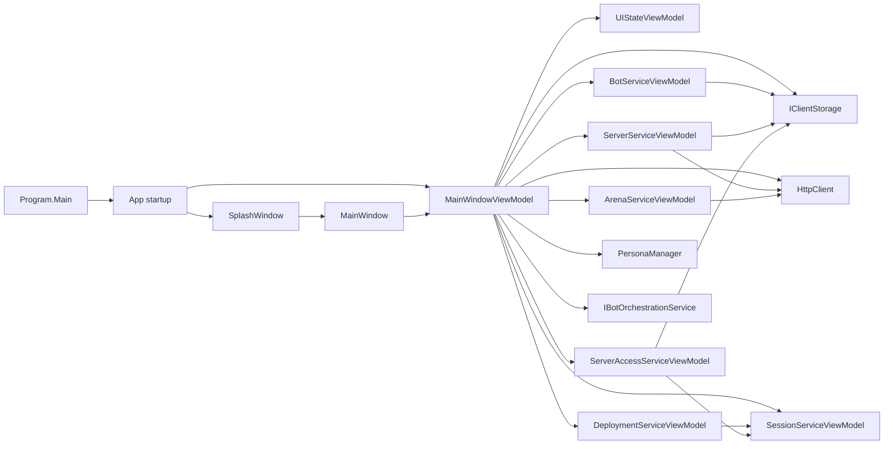

# BBS Client Application Architecture

This document describes the structure of the BBS desktop client as it exists today. It is intended to replace refactor-era working notes with a stable, versionable description of how the application is assembled, how data flows through it, and where the major boundaries live.

## Scope

The client is an Avalonia desktop application that coordinates local persona management, bot and server profile editing, deployment into live sessions, and arena viewing. It is not the game engine or server runtime; it is the operator-facing control surface for those systems.

Primary responsibilities:

- bootstrap the desktop shell and application services
- load and unload personas that define the active workspace
- edit and persist bot and server profiles
- probe server reachability and cached metadata
- deploy bots into server sessions and track runtime session state
- load arena data and present live/replay viewing surfaces
- coordinate UI context between home, editor, details, and viewer modes

## Startup Flow

The application starts in [`Program.Main`](../../bbs-client/src/Bbs.Client.App/Program.cs), which builds the Avalonia app and starts the classic desktop lifetime.

`App.OnFrameworkInitializationCompleted` wires the runtime together:

1. create the logger and persona manager
2. probe whether the embedded WebView runtime is available
3. construct `MainWindowViewModel`
4. show the splash window first
5. open the main window after splash playback completes
6. unload the active persona and close runtime sessions during shutdown

That means the shell is not a passive view. It is an application host that initializes service objects, then hands control to the main viewmodel tree.

## High-Level Structure

## Layering Model

The client is organized as a presentation shell over a set of service-style viewmodels.

### 1. Shell Layer

The shell layer is responsible for Avalonia window composition and startup choreography.

- [`Program`](../../bbs-client/src/Bbs.Client.App/Program.cs) starts the app
- [`App`](../../bbs-client/src/Bbs.Client.App/App.axaml.cs) creates services and windows
- [`MainWindow`](../../bbs-client/src/Bbs.Client.App/Views/MainWindow.axaml) hosts the primary dashboard UI
- [`SplashWindow`](../../bbs-client/src/Bbs.Client.App/Views/SplashWindow.axaml.cs) handles the startup presentation

The shell stays deliberately thin. Its job is to construct the object graph, not to own business logic.

### 2. Workspace State Layer

[`UIStateViewModel`](../../bbs-client/src/Bbs.Client.App/ViewModels/UIStateViewModel.cs) owns pure UI state:

- current workspace context
- left and right panel expansion state
- context-driven visibility flags
- calculated panel widths and labels

This type is intentionally independent of storage and networking so it can be reasoned about and tested in isolation.

### 3. Domain-Oriented Service ViewModels

The main window delegates work to focused viewmodels instead of putting all behavior into one class.

- [`BotServiceViewModel`](../../bbs-client/src/Bbs.Client.App/ViewModels/BotServiceViewModel.cs) owns bot profile editing and bot list projection
- [`ServerServiceViewModel`](../../bbs-client/src/Bbs.Client.App/ViewModels/ServerServiceViewModel.cs) owns server editing, discovery, and cached plugin metadata
- [`ArenaServiceViewModel`](../../bbs-client/src/Bbs.Client.App/ViewModels/ArenaServiceViewModel.cs) owns arena selection, arena watching, and viewer state
- [`DeploymentServiceViewModel`](../../bbs-client/src/Bbs.Client.App/ViewModels/DeploymentServiceViewModel.cs) owns deploy-and-register workflow
- [`SessionServiceViewModel`](../../bbs-client/src/Bbs.Client.App/ViewModels/SessionServiceViewModel.cs) owns active runtime session projection and actions
- [`ServerAccessServiceViewModel`](../../bbs-client/src/Bbs.Client.App/ViewModels/ServerAccessServiceViewModel.cs) owns owner-token and dashboard access resolution

`MainWindowViewModel` remains the orchestration layer that coordinates these pieces and exposes the bindings the UI expects.

## Data Ownership

The client does not use one monolithic state object. Instead, each service viewmodel owns a narrow slice of state:

- `BotServiceViewModel`: bot editor fields and bot list
- `ServerServiceViewModel`: server editor fields, selected server, metadata, and plugin catalog
- `ArenaServiceViewModel`: arena lists, viewer label/status, and embedded-viewer sizing
- `DeploymentServiceViewModel`: deployment status text
- `SessionServiceViewModel`: active bot-session projections
- `ServerAccessServiceViewModel`: access metadata, owner token display, and dashboard endpoint
- `UIStateViewModel`: panel widths and current screen context

`MainWindowViewModel` composes those values into the application-level bindings used by the XAML.

## Key Runtime Flows

### Persona Loading

Persona management is the boundary between the user’s workspace files and the live runtime state.

1. the user loads or creates a persona
2. `PersonaManager` swaps the active workspace storage/orchestration context
3. bot and server lists are refreshed from the active persona storage
4. the UI returns to the current workspace context with new bindings

### Bot Editing and Persistence

Bot editing is handled as a simple form-to-profile workflow.

1. a bot card is selected or a new bot is created
2. `BotServiceViewModel` populates editor fields
3. the user saves the form
4. a `BotProfile` is created and validated
5. storage is updated and the bot list is refreshed

### Server Discovery and Details

Server work is split between local profile editing and remote probing.

1. the user edits a server record or selects an existing one
2. `ServerServiceViewModel` loads details and cached plugin catalog entries
3. a probe cycle checks `/api/status` using the configured endpoint candidates
4. metadata and plugin catalog information are written back to storage
5. the selected server detail view updates through property notifications

### Deployment and Session Tracking

Deployment is the most coupled workflow in the client because it spans storage, orchestration, control sockets, and session projection.

1. the user selects a bot and a live server
2. `DeploymentServiceViewModel` launches a runtime instance through `IBotOrchestrationService`
3. the control socket is opened and the agent handshake is completed
4. runtime metadata is stored and the session is registered in `SessionServiceViewModel`
5. `ServerAccessServiceViewModel` resolves owner-token access for follow-up actions

This is the point where the client becomes a live operator console rather than a static editor.

### Arena Watching

Arena watching is owned by `ArenaServiceViewModel`.

1. the user selects a server arena
2. arena viewer state is projected into the UI
3. a polling loop refreshes arena state at a fixed interval
4. embedded viewer sizing is derived from the current host surface
5. when embedded WebView support is unavailable, the client falls back to the browser viewer path

## UI Composition

[`MainWindow.axaml`](../../bbs-client/src/Bbs.Client.App/Views/MainWindow.axaml) is a three-column workspace shell:

- left panel: bots and bot actions
- center panel: workspace content, editors, and live details
- right panel: servers, server details, arena controls, and runtime access state

The center panel changes based on `UIStateViewModel.CurrentContext`. That means the app behaves more like a workspace dashboard than a traditional multi-page navigation app.

The main window also includes a small amount of view-specific behavior in code-behind:

- startup logo pulse / brand overlay animation
- embedded viewer host sizing
- splash-to-main handoff support

Those are visual concerns that do not belong in the viewmodel layer.

## Concurrency and Boundaries

The client is mostly UI-thread driven, but several operations are deliberately asynchronous:

- server probes
- arena refresh polling
- deployment handshake retries
- embedded-viewer initialization
- persona loading and unloading

The important boundary is that background work updates state through property notifications and collection refreshes, not by mutating XAML directly.

Where shared mutable state exists, the code uses local locks and versioning to avoid overlapping probe or refresh work.

## Infrastructure Dependencies

The client depends on a small set of concrete infrastructure services:

- `IClientStorage` for persistence of profiles and cached state
- `IBotOrchestrationService` for launching and managing runtime instances
- `PersonaManager` for workspace persona file lifecycle
- `HttpClient` for server status, catalog, arena, and access calls
- `IClientLogger` for telemetry and diagnostics

The client is therefore not a pure MVVM sample. It is a desktop operator application with direct ties to local runtime control and storage.

## Architectural Constraints

Current constraints worth preserving:

- the app assumes a local trusted filesystem and local runtime orchestration
- the embedded WebView path is optional and may be unavailable on Linux
- the server-side runtime and client-side UI are intentionally separate processes
- the client currently favors pragmatic service viewmodels over a larger DI container pattern

These constraints are part of the current architecture, not just implementation details.

## Relationship To Other Docs

This document is the high-level client counterpart to the server/runtime architecture doc in [`ARCHITECTURE.md`](ARCHITECTURE.md).

Recommended companion docs:

- [`PROTOCOL.md`](../reference/PROTOCOL.md) for TCP bot protocol details
- [`BBS_AGENT_CONTRACT.md`](../reference/BBS_AGENT_CONTRACT.md) for local control bridge semantics
- [`PLUGIN_AUTHORING.md`](../guides/PLUGIN_AUTHORING.md) for plugin authoring and release workflow
